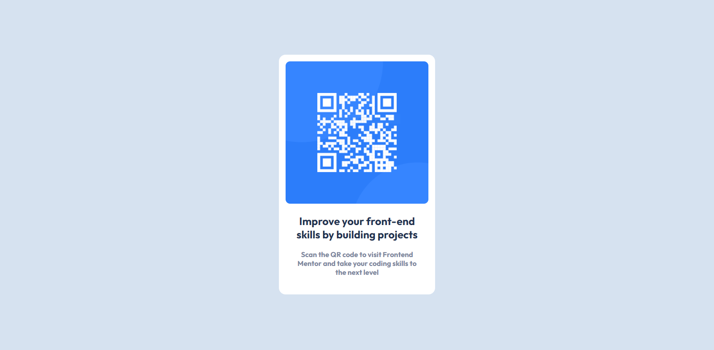

# Frontend Mentor - QR code component solution

## Table of contents

- [Overview](#overview)
  - [Screenshot](#screenshot)
  - [Links](#links)
- [My process](#my-process)
  - [Built with](#built-with)
  - [What I learned](#what-i-learned)
  - [Continued development](#continued-development)
  - [Useful resources](#useful-resources)
- [Author](#author)
- [Acknowledgments](#acknowledgments)

## Overview

A simple HTML and CSS component that utilizes ones skill on margins, paddings, fonts sizes and so on.

### Screenshot

### Links

- Solution URL: [Add solution URL here](https://your-solution-url.com)
- Live Site URL: [Add live site URL here](https://your-live-site-url.com)

## My process

Step one: Adding the HTML elements
Step two: Styling with CSS
Step three: Correcting errors

### Built with

- Semantic HTML5 markup
- CSS custom properties
- Flexbox
- SCSS

### What I learned

- Semantic HTML5 markup
- CSS custom properties
- Flexbox
- SASS

### Continued development

- Making Responsive websites/apps
- improving user experience

### Useful resources

- [Traversy Media - Flexbox Crash Course](https://www.youtube.com/watch?v=3YW65K6LcIA) - This resource was really helpful in grasping the basics of flexbox. I really liked this pattern and will use it going forward.
- [Traversy Media - Sass Crash Course](https://www.youtube.com/watch?v=nu5mdN2JIwM&t=424s) - Splendid tutorial for getting in into sass. I'd recommend it to anyone still learning this concept.

## Author

- Frontend Mentor - [@nuelobeto](https://www.frontendmentor.io/profile/nuelobeto)

## Acknowledgments

Kudos to ((https://www.frontendmentor.io) for provide such an amazing platform for budding and experienced developers alike to hone and grow their skills. Truly magnificent!
A big thank you to content creators who selflessly provide tutorials and resources for learning. Y'all are the real MVPs.
